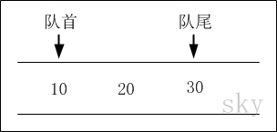
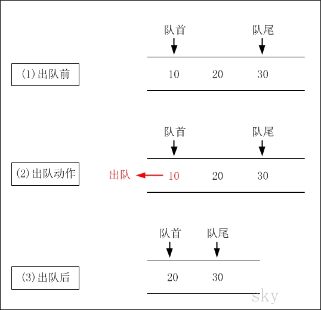
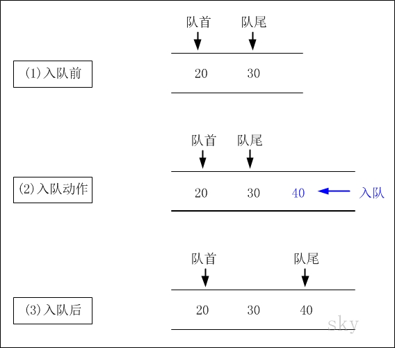

队列与实现
====

##概要
* 队列的介绍
* 队列的java实现

##队列的介绍
队列（Queue），是一种线性存储结构。它有以下几个特点：

* 1.队列中数据是按照"先进先出（FIFO, First-In-First-Out）"方式进出队列的。
* 2.队列只允许在"队首"进行删除操作，而在"队尾"进行插入操作。

队列通常包括的两种操作：入队列 和 出队列。

###1. 队列的示意图
</img>

队列中有10，20，30共3个数据

###2. 出队列
</img>

出队列前：队首是10，队尾是30。  
出队列后：出队列(队首)之后。队首是20，队尾是30。

###3. 入队列
</img>

入队列前：队首是20，队尾是30。   
入队列后：40入队列(队尾)之后。队首是20，队尾是40。

